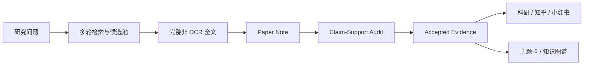

# Embodied AI Evidence Hub｜具身智能证据知识库

> 把具身智能文献，变成可检索、可审计、可引用、可复用的研究基础设施。

[](https://github.com/yuanzh0u/embodied-learning/actions/workflows/research-validation.yml)

[在线阅读](https://yuanzh0u.github.io/embodied-learning/) · [专题目录](https://yuanzh0u.github.io/embodied-learning/research/) · [知识图谱](https://yuanzh0u.github.io/embodied-learning/knowledge-map/) · [成果目录](knowledge/literature-review-catalog.md)

Embodied AI Evidence Hub 是一个证据优先的具身智能研究知识库。它围绕 VLA、世界模型、4D 时空推理、多模态感知、机器人数据与闭环评测，把检索、全文精读、主张审计、综述写作和知识路由连接成可追溯的研究流程。

Embodied AI Evidence Hub is an evidence-first research hub for embodied AI and robot learning. It turns literature discovery, full-text reading, claim audits, review writing, and agent-ready knowledge routing into one traceable workflow.

这不是论文链接收藏夹，也不是自动摘要合集。每条进入正式证据层的主张都应能回到论文全文、结构化 paper note、claim-support audit 和明确的适用边界。

如果这个项目帮你少走一轮检索、少踩一个论证坑，欢迎 [Star 本仓库](https://github.com/yuanzh0u/embodied-learning)。你的 Star 会帮助更多研究者发现这套开放研究基础设施。

## 当前规模

以下数字来自当前 [文献综述成果目录](knowledge/literature-review-catalog.md) 与已结算证据层：

| 当前成果 | 规模 |
|---|---:|
| 文献综述专题 | **38 项** |
| 基础综述 | **22 项** |
| 跨 run 综合 | **14 项** |
| 引文图派生综述 | **2 项** |
| 不重复精读论文 | **223 篇** |
| 正式证据事件 | **371 条** |
| 可复用 AI 研究技能 | **7 个** |

候选论文、搜索命中和复用证据不重复计入这些核心数字。覆盖规模不等于结论强度，最终判断仍以正文中的任务范围、证据质量与失败边界为准。

## 从代表性专题开始

每个专题都有永久 canonical 地址。静态页无需 JavaScript，即可阅读知乎解释版完整正文、论文引用、证据规模和完整证据附录。

- [世界模型评测边界](https://yuanzh0u.github.io/embodied-learning/research/world-model-evaluation-boundaries/) — 世界模型何时能参与闭环评测，何时不能充当真值源
- [世界模型需要什么样的训练数据](https://yuanzh0u.github.io/embodied-learning/research/world-model-training-data/) — 从视频预测走向动作干预与可执行状态
- [VLA 的语言、视觉与动作对齐](https://yuanzh0u.github.io/embodied-learning/research/vla-language-vision-action-alignment/) — 稀疏语言、稠密视觉与连续动作的粒度错配
- [4D 时空推理的数据要求](https://yuanzh0u.github.io/embodied-learning/research/4d-reasoning-data-requirements/) — 动态世界状态、对应关系与动作后果
- [触觉世界模型](https://yuanzh0u.github.io/embodied-learning/research/tactile-world-models/) — 接触状态如何补足纯视觉不可观测信息
- [具身智能数据质量](https://yuanzh0u.github.io/embodied-learning/research/embodied-ai-data-quality/) — 数据质量为何必须相对于目标任务定义
- [Ego–Exo 相机标定与视角对齐](https://yuanzh0u.github.io/embodied-learning/research/ego-exo-camera-calibration-alignment/) — 几何注册与表征迁移的不同边界
- [Loco-Manipulation 研究进展](https://yuanzh0u.github.io/embodied-learning/research/loco-manipulation-progress/) — 移动与操作耦合下的系统进展

[浏览全部 38 个专题](https://yuanzh0u.github.io/embodied-learning/research/)

## 为什么采用证据优先

- **完整全文优先**：摘要和搜索片段不能单独进入正式证据；扫描型、无法可靠解析的论文不进入接受证据。
- **逐篇主张审计**：paper note 记录论文问题、方法、实验和限制；claim-support audit 检查综合主张是否被原文支持。
- **结论携带边界**：任务、数据、平台、评测方法或时间窗口不同，结论不能直接外推。
- **一份证据，三种表达**：科研备忘录、知乎解释版与小红书版共享证据层，但分别按读者目标组织表达。
- **为 Agent 分层加载**：主索引、主题卡、review packet 和论文笔记构成从低预算到高预算的上下文路径。
- **版本可追溯**：正式成果按 run 追加保存；Wiki 使用不可变快照和原子指针发布，可验证并可回滚。

## 一条结论如何进入知识库



三条底线贯穿整个流程：Candidate 不等于 Evidence；结论必须说明边界；读者文章必须能够回到 evidence event、paper note、审计记录和论文原文。

## 两种阅读方式

### 搜索友好的静态专题页

[静态专题目录](https://yuanzh0u.github.io/embodied-learning/research/) 为 38 个当前专题提供永久地址。页面包含双语标题、30 秒结论、证据统计、知乎正文、去重论文引用、完整证据附录和结构化元数据。

### 交互 Wiki

[交互 Wiki](https://yuanzh0u.github.io/embodied-learning/) 保留全文搜索、三版本切换、证据抽屉、原子快照与知识图谱。静态页与 Wiki 指向同一份已验证证据快照，不维护两套研究内容。

## 三分钟开始使用

### 本地打开 Wiki

```bash
git clone https://github.com/yuanzh0u/embodied-learning.git
cd embodied-learning
python3 scripts/serve_research_wiki.py --open
```

macOS 用户也可以双击根目录的 `打开具身智能研究Wiki.command`。

### 构建完整发布站点

```bash
python3 scripts/build_research_wiki.py --output /tmp/wiki-data
python3 scripts/build_research_site.py \
  --snapshot-root /tmp/wiki-data \
  --wiki-root wiki \
  --output /tmp/wiki-site \
  --base-url https://yuanzh0u.github.io/embodied-learning
```

生产构建会验证全部发布 slug、快照 schema、证据事件计数、页面 metadata、JSON-LD、内部链接、Sitemap 和 robots 策略。缺少发布配置、失效相对链接或证据计数不一致都会直接失败。

### 交给 AI Agent 使用

让支持 `AGENTS.md` 的智能体从 [knowledge/index.md](knowledge/index.md) 开始，只加载与问题匹配的主题卡。

```text
先读取 knowledge/index.md。
围绕“世界模型怎样进入机器人闭环评测”选择相关主题卡，
再从 literature-review-catalog.md 定位当前 review packet；
每条综合判断都保留证据入口，并明确哪些内容属于推断。
```

## 7 个可复用研究技能

| 技能 | 作用 |
|---|---|
| `embodied-ai-literature-review` | 编排从研究问题到综述交付的完整流程 |
| `embodied-ai-query-planner` | 把主题拆成覆盖驱动的检索计划 |
| `embodied-ai-literature-hub` | 扩展候选池并恢复可审计全文 |
| `embodied-ai-paper-reader` | 精读论文，生成 paper note 与证据事件 |
| `embodied-ai-review-writer` | 从 accepted evidence 生成不同文体 |
| `embodied-ai-influence-ranking` | 沿引文图评估后续影响力 |
| `embodied-ai-problem-relevance-ranking` | 在引文图候选中检索问题相关论文 |

## 仓库结构

```text
embodied-learning/
├── knowledge/   # 主索引、主题卡、术语与综述路由
├── evidence/    # 论文笔记、审计记录、证据事件与正式成稿
├── skills/      # 7 个可复用 AI 研究技能
├── scripts/     # 构建、验证、审计与知识图谱工具
├── wiki/        # Wiki 模板、发布配置与前端资产
├── tests/       # 快照、渲染、链接与 SEO/GEO 回归测试
└── docs/        # 架构决策与设计文档
```

`evidence/` 是论文级证据与正式综述的 source of truth；`knowledge/` 是面向人和 Agent 的压缩工作记忆；候选池与中间产物进入 gitignored 的 `work/`。

## 如何引用

引用整个知识库时，请使用仓库根目录的 [CITATION.cff](CITATION.cff)。GitHub 页面中的 “Cite this repository” 可以据此生成引用格式。

引用某个研究判断时，优先引用对应静态专题的 canonical 地址，并保留访问日期。学术论证仍应同时引用专题页列出的原始论文；本知识库的综合判断不能替代原论文。

建议格式：

```text
Embodied AI Evidence Hub. “专题中文标题 / English Title.”
具身智能证据知识库，访问日期 YYYY-MM-DD，canonical URL。
```

## 许可与第三方边界

- `.github/`、`scripts/`、`skills/`、`tests/` 与 `wiki/` 中的代码采用 [MIT License](LICENSE)。
- `knowledge/`、`evidence/`、`docs/`、项目上下文和 README 中的研究内容采用 [CC BY-NC-SA 4.0](LICENSE-CONTENT)。
- 论文标题、摘要片段、引用信息及链接仍受原作者与出版方权利约束，不因进入本仓库而改变版权归属。

目录级适用范围、混合文件和第三方材料边界见 [LICENSES.md](LICENSES.md)。

## 参与建设

欢迎通过 [Issues](https://github.com/yuanzh0u/embodied-learning/issues) 提交值得系统梳理的研究问题、证据缺口、边界遗漏、失效链接、新论文线索或研究工具改进建议。

提交证据时，请同时说明论文、原文位置、支持的主张和适用边界。新增材料应遵循 [素材入库规范](knowledge/ingestion-guide.md)。

## 致谢

本项目使用 AI 辅助检索、精读、审计与写作，但不把模型输出直接当作论文证据。论文版权归原作者所有；仓库中的综合判断应结合具体任务边界使用。

---

**研究不是把论文堆得更高，而是让每个判断都能回到证据。**

[开始阅读](https://yuanzh0u.github.io/embodied-learning/) · [浏览全部专题](https://yuanzh0u.github.io/embodied-learning/research/) · [查看源代码](https://github.com/yuanzh0u/embodied-learning) · [Star 项目](https://github.com/yuanzh0u/embodied-learning)
