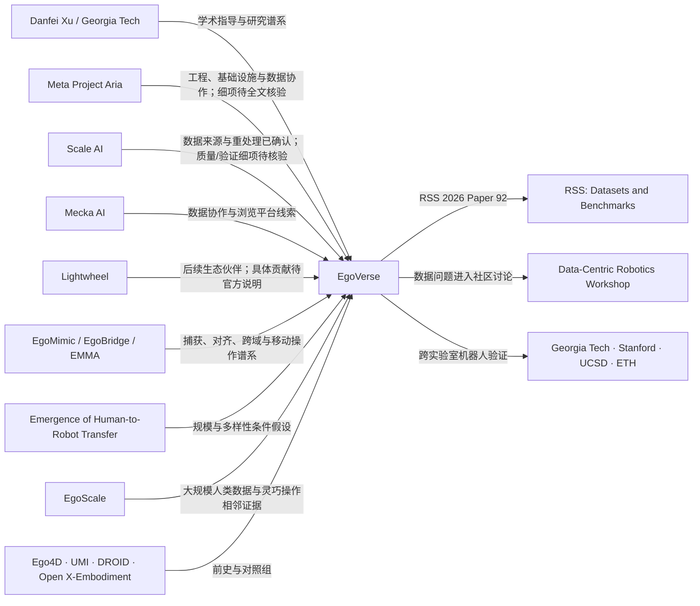

# EgoVerse 生态关系图

更新：2026-07-23。本文只表达已核实关系与待验证角色，不把合作关系自动升级为科学证据。

## 中心结构

## 合作角色矩阵

| 组织 | 已确认关系 | 当前可赋予角色 | 暂不能声称 | 主要依据 |
|---|---|---|---|---|
| Georgia Tech | 总体项目负责人、核心贡献者和 PI | 项目统筹、采集、系统、实验、分析 | 所有数据或全部工程均由 Georgia Tech 完成 | EgoVerse team；论文贡献声明 |
| Stanford / UCSD / ETH | 论文中的跨实验室参与方 | 多机器人、多任务和跨实验室实验 | 已证明任意机器人或任意任务上的普遍泛化 | 官网实验列表；论文全文待审计 |
| Meta Project Aria | 论文原始产业伙伴；两名具名贡献者 | 工程、基础设施、数据协作；Project Aria 捕获技术上下文 | Meta 独立提供了 EgoVerse 的全部硬件、数据或标注 | team page；论文贡献声明；EgoMimic |
| Scale AI | 论文原始产业伙伴；两名具名贡献者；代码记录 Scale 数据重处理 | 数据提供/处理角色已确认，训练验证为待核验子角色 | Scale 数据规模、质量或收益已经被论文单独证明 | team page；GitHub changelog；Scale 官方业务页 |
| Mecka AI | 论文原始产业伙伴；两名具名贡献者 | 数据协作、数据浏览/基础设施线索 | 浏览器托管等同于拥有或独立生成全部数据 | team page；GitHub README |
| Lightwheel | 2026 年 7 月后的新增生态伙伴，官网列名并与 EgoVerse 共办 RSS 社群活动 | 生态合作关系；其自身能力覆盖人类数据、仿真与评测 | 已向当前论文版本贡献数据、仿真或评测 | EgoVerse 首页；Danfei 更新；Lightwheel 官网 |
| MicroAGI / Trace | 后续新增伙伴线索 | 生态关系待进一步核实 | 具体数据、工程或商业角色 | Danfei 更新；EgoVerse 首页 |

## 研究谱系

1. **捕获与统一策略**：EgoMimic 把 Project Aria、3D 手部追踪、低成本双臂机器人、跨域对齐和人机数据共训连成一体。
2. **数据组成而非只看规模**：*What Matters* 将采集多样性和目标检索对齐拆开，提示相机位姿、空间布局等维度会改变下游效用。
3. **显式跨域对齐**：EgoBridge 把人/机视觉、传感器与运动学差距作为核心变量。
4. **扩大任务与本体**：EMMA 扩展到移动操作；*Emergence* 研究 VLA 中多样预训练后的迁移；EgoScale 扩展到高自由度灵巧手。
5. **生态化与复现实验**：EgoVerse 将数据、格式、处理、访问、训练和跨实验室评测组织成 living ecosystem。

## 证据边界

- RSS 接收证明其进入正式同行评议会议，不证明每个规模或泛化主张都成立。
- 公司官网和推文只能支持组织关系、产品定位和最新动态；科学结论必须回到完整论文与审计事件。
- “consortium partner”不等于“数据供应商”，“论文作者”不等于“商业客户”，“新增伙伴”也不等于进入当前论文实验。
- 数据集规模是版本化事实；living dataset 的网页数字必须带抓取日期，不能和论文版本混写。
