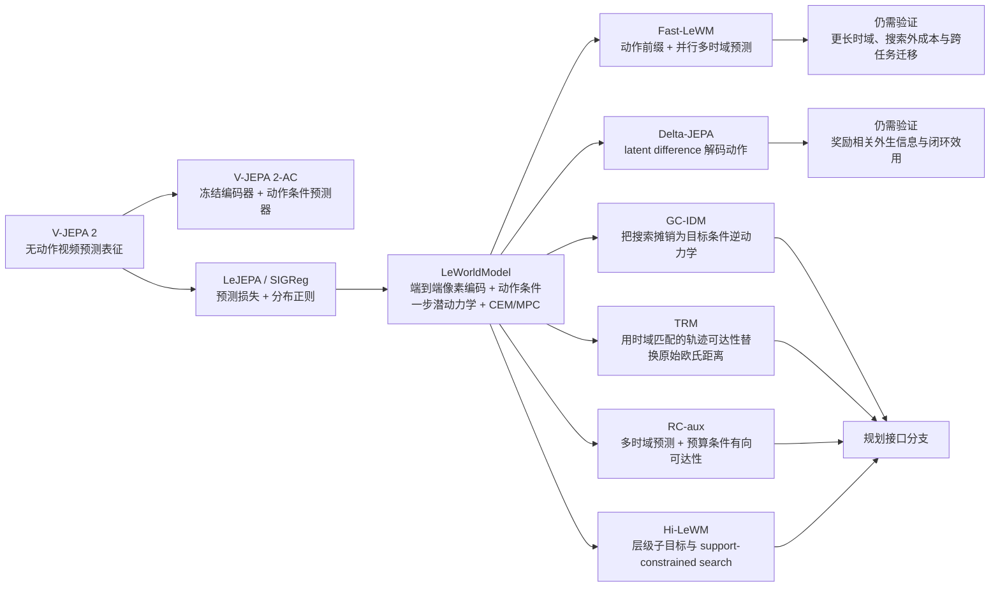

# LeWorldModel 技术谱系：系统学习与复现指南

> 版本：2026-07-25  
> 范围：从 JEPA 视频表征、SIGReg 防坍塌、LeWorldModel 潜空间动力学，到动作敏感性、长程预测、规划接口与闭环效用。  
> 证据边界：本文的论文事实只来自当前综述运行中已完成全文精读、原文定位与 claim-support audit 的事件，以及本轮显式复用的既有审核事件。公式均是为统一不同论文而写的**教学化示意**，不是对论文符号的逐字复刻。

## 先给结论：这条路线不是“一个模型不断变快”，而是五个不同问题逐层暴露

从像素到控制，至少要依次回答五个不能互相替代的问题：

1. **训练稳定**：表征会不会坍塌，优化是否可控？
2. **动作敏感**：同一状态下，不同动作会不会产生可区分的潜空间后果？
3. **长程动力学**：一步预测滚动到多步时，误差、计算和时域错配是否可控？
4. **规划接口**：潜空间距离、可达性、逆动力学或子目标，能否正确排序候选动作？
5. **闭环效用**：上述优势能否转化为真实执行中的成功、安全、恢复和延迟收益？

最重要的学习纪律是：**上一层通过，不代表下一层自动通过。**  
LeJEPA/SIGReg 能帮助防坍塌，却没有直接提供动作条件控制证据；Delta-JEPA 能让潜空间对动作更敏感，却没有证明它保留所有奖励相关信息；开放环预测更准，也不等于规划代价会正确排序，更不等于闭环成功。

## 统一符号与最小问题定义

后文统一使用：

- \(o_t\)：时刻 \(t\) 的像素观测；
- \(a_t\)：执行动作；
- \(z_t=f_\theta(o_t)\)：编码器产生的潜表示；
- \(\hat z_{t+h}=g_\phi(z_{\le t},a_{t:t+h-1})\)：动作条件的未来潜状态预测；
- \(o_g,z_g=f_\theta(o_g)\)：目标图像与目标潜表示；
- \(H\)：预测或规划时域；
- \(J(\mathbf a)\)：候选动作序列 \(\mathbf a=a_{t:t+H-1}\) 的规划代价。

最基础的潜空间规划可以写成：

\[
\mathbf a^\star
=\arg\min_{\mathbf a}
J(\mathbf a),
\qquad
J_{\text{latent}}(\mathbf a)
=d\!\left(\hat z_{t+H}(\mathbf a),z_g\right).
\]

如果用 CEM 搜索，就反复采样动作序列、预测终点、按 \(J\) 选精英样本并更新采样分布；如果用 MPC，则只执行当前计划的一段动作，得到新观测后再规划。

这套写法隐藏了四个危险假设：

- \(f_\theta\) 没有坍塌；
- \(g_\phi\) 真正响应动作，而不是主要依赖状态或数据相关性；
- 多步预测没有严重漂移；
- \(d(\hat z,z_g)\) 与有限动作预算下的真实可达性一致。

后续论文基本都在修补其中一项，而不是一次解决全部问题。

## 技术谱系总览

下图的箭头表示“前一节点暴露的问题，后一节点给出的机制响应”，不表示严格的发表先后、代码继承或完整因果关系。



一句话概括每个节点：

| 节点 | 主要解决什么 | 没有自动解决什么 |
|---|---|---|
| V-JEPA 2 | 从视频中学习可预测的语义动态表征 | 无动作预训练本身不包含机器人动作的因果效应 |
| LeJEPA / SIGReg | 用预测目标与可扩展分布正则抑制坍塌 | 未直接验证动作条件动力学、规划或闭环控制 |
| LeWorldModel | 端到端联合学习像素编码与动作条件潜动力学，并接入 CEM/MPC | 短时域、动作敏感性、潜距离可达性和低维任务流形仍可能失配 |
| Fast-LeWM | 把局部一步滚动改为动作前缀驱动的并行多时域预测 | 现有证据只验证同一 CEM 协议下的时域接口改造，未证明终端代价或搜索边界也被消除 |
| Delta-JEPA | 用 latent displacement 解码动作，直接约束转移几何的动作敏感性 | 不保证保留与动作独立但奖励相关的外生特征 |
| GC-IDM | 把在线搜索摊销成目标条件、时域条件的下一动作预测 | 不显式推演多步后果，训练时域外输入会退化 |
| TRM | 修复“欧氏距离近但不可达”的终端排序问题 | 依赖轨迹覆盖，当前代理不等于完整有向可达性 |
| RC-aux | 同时修正训练时域错配和预算条件可达性几何 | 未观察捷径、不确定性和完整可行性判断仍未解决 |

## 建议学习节奏

推荐用六周完成十个单元：

| 周 | 单元 | 目标 |
|---|---|---|
| 第 1 周 | 1–3 | 建立最小系统、分清视频预测与动作模型、实现防坍塌诊断 |
| 第 2 周 | 4 | 完整复现 LeWM 风格的像素—潜动力学—CEM/MPC 闭环 |
| 第 3 周 | 5 | 做动作反事实和外生奖励特征压力测试 |
| 第 4 周 | 6–7 | 拆解长程误差、前缀预测、搜索摊销和可达性代价 |
| 第 5 周 | 8–9 | 研究层级规划失败，并建立五层诊断仪表盘 |
| 第 6 周 | 10 | 完成统一复现实验矩阵、评测报告和 go/no-go 结论 |

---

## 学习单元 1：先搭出“可证伪”的最小潜空间规划系统

### 核心问题

一个从像素出发的潜空间世界模型，究竟包含哪些独立部件？训练损失、潜动力学、终端代价、搜索器和闭环执行分别可能在哪里出错？

### 必读论文

- [LeWorldModel: Stable End-to-End Joint-Embedding Predictive Architecture from Pixels](https://arxiv.org/abs/2603.19312)
- [World Model for Robot Learning: A Comprehensive Survey](https://arxiv.org/abs/2605.00080)
- [MiraBench: Evaluating Action-Conditioned Reliability in Robotic World Models](https://arxiv.org/abs/2605.29360)

### 公式 / 机制

把系统强制拆成五个接口：

\[
\begin{aligned}
z_t &= f_\theta(o_t),\\
\hat z_{t+1} &= g_\phi(z_{t-k:t},a_t),\\
\hat z_{t+H} &= \operatorname{Rollout}(g_\phi,z_t,\mathbf a),\\
J(\mathbf a) &= c(\hat z_{t+H},z_g),\\
\mathbf a^\star &= \operatorname{Planner}(J),\quad
o_{t+\Delta}\leftarrow\operatorname{Execute}(\mathbf a^\star_{1:\Delta}).
\end{aligned}
\]

这里的关键不是把损失写得更复杂，而是让每个接口都有独立可测指标。复用证据中的综述指出，纯反应式 VLA 会受长时程推理、时序归因与误差累积限制；MiraBench 则要求世界模型评测从视觉保真扩展到物理遵从、动作跟随和乐观偏差。

### 动手输出

提交一页 `system-contract.md`，至少包含：

1. 每个张量的形状、坐标系和时间频率；
2. 训练时与规划时的数据流；
3. 每个接口的一个正向指标和一个反例；
4. “模型预测错”“代价排错”“搜索没搜到”“控制没执行好”四类失败的日志字段；
5. 一个仅用真实终点状态排序的 oracle selector，作为规划接口上界。

### 自测题

1. 为什么预测损失下降不能证明 CEM 会选到更好的动作？
2. MPC 重规划能缓解什么误差，不能修复什么表示缺陷？
3. 若视频看起来逼真但动作改变后未来几乎不变，应归入哪一层失败？

合格标准：能把一次闭环失败定位到五个接口之一，而不是笼统归因于“世界模型不准”。

---

## 学习单元 2：V-JEPA 2——先分清“视频表征”与“机器人动作模型”

### 核心问题

无动作视频预测学到的表征，为什么不能直接当作机器人世界模型？动作因果效应是在哪个阶段被加入的？

### 必读论文

- [V-JEPA 2: Self-Supervised Video Models Enable Understanding, Prediction and Planning](https://arxiv.org/abs/2506.09985)

### 公式 / 机制

用统一符号区分两个阶段：

\[
\text{无动作视频预训练：}\quad
\hat z_{\text{target}}=p_\phi(z_{\text{context}})
\]

\[
\text{动作适配：}\quad
\hat z_{t+1}=g_\psi(z_{\le t},a_t),
\qquad f_\theta\ \text{冻结}.
\]

V-JEPA 2 的目标是预测场景中可预测的部分，而不是复原所有不可预测像素细节。它的无动作视频预训练不直接建模机器人动作的因果效应；论文通过在冻结视频编码器上另外训练帧因果、动作条件预测器，才把表征接到规划。

论文的机器人结果要带着边界读：同一套 V-JEPA 2-AC 权重和推理代码被复用于两座未出现在 Droid 数据中的实验室；三个单目标 reaching 实例中末端进入目标 4 cm 内。但已验证规划时域约为 16 秒，更长程的 pick-and-place 在没有子目标时仍需要新方法。未标定单目相机还会带来动作坐标轴欠定，作者实际尝试多个相机位置后才固定配置。

### 动手输出

做一个“冻结边界”对照：

| 版本 | 编码器 | 动作预测器 | 训练数据 | 评测 |
|---|---|---|---|---|
| A | 冻结视频编码器 | 无 | 无动作视频 | 表征 probe |
| B | 冻结视频编码器 | 有 | 机器人图像—动作 | 开放环动作条件预测 |
| C | 可训练编码器 | 有 | 同 B | 开放环 + 闭环 |

输出三项：

1. 固定历史、改变动作的潜响应图；
2. 相机视角或标定扰动下的动作误差；
3. 训练域、实验室域和目标任务域三者的边界表。

### 自测题

1. 为什么 V-JEPA 2 的视频理解能力不能直接证明动作条件预测正确？
2. 冻结编码器的好处与代价分别是什么？
3. “跨两座实验室复用权重”能证明什么，又不能证明什么？

合格标准：能明确区分表征预训练证据、动作适配证据和闭环控制证据。

---

## 学习单元 3：LeJEPA / SIGReg——防坍塌是必要条件，不是控制充分条件

### 核心问题

在不使用 teacher–student、stop-gradient 或 prototype 的情况下，如何防止联合嵌入预测退化为常量表示？分布正则为何可能与低维任务流形冲突？

### 必读论文

- [LeJEPA: Provable and Scalable Self-Supervised Learning Without the Heuristics](https://arxiv.org/abs/2511.08544)
- [LeWorldModel](https://arxiv.org/abs/2603.19312) 的 SIGReg 与 Two-Room 负结果

### 公式 / 机制

LeJEPA 的教学化目标可写成：

\[
\mathcal L
=\mathcal L_{\text{pred}}
+\lambda_{\text{sig}}\mathcal L_{\text{SIGReg}}.
\]

令 \(u\) 是随机单位方向，\(\hat\varphi_u(s)\) 是 minibatch 中投影
\(\{u^\top z_i\}\) 的经验特征函数，则可把一维正态匹配示意为：

\[
\mathcal L_{\text{SIGReg}}
\propto
\mathbb E_{u}
\int
\left|
\hat\varphi_u(s)-e^{-s^2/2}
\right|^2w(s)\,ds.
\]

已审核事件支持以下事实：

- LeJEPA 把多视图预测损失与 SIGReg 合并，去掉 prototype、stop-gradient 和 teacher–student，只保留一个平衡预测与正则的系数；
- 它选用 Epps–Pulley 经验特征函数正则，是因为实现适合 DDP、梯度和曲率有界、内存与计算复杂度线性；
- LeWM 将潜变量沿随机方向投影，并用一维 Epps–Pulley 正态性统计逼近各向同性高斯；从一维投影到联合分布的论证对投影数是渐近的；
- 实际 minibatch SIGReg 梯度有偏，论文只报告实验中偏差较小；
- LeJEPA 的实证没有直接测试动作条件动力学、rollout、规划或闭环控制。

LeWM 在简单 Two-Room 上表现较差；作者把“低数据多样性、低内在维度与高维各向同性高斯先验冲突”作为一种可能解释，而不是已证实的普遍因果结论。

### 动手输出

实现三个训练版本：

1. 仅预测损失；
2. 预测损失 + SIGReg；
3. SIGReg 系数过小、合理、过大的 sweep。

每个版本至少记录：

- 每维方差、协方差谱、effective rank；
- 随机投影正态性统计；
- encoder 与 predictor 梯度范数；
- 三个以上随机种子的损失、probe 与闭环方差；
- 高多样性任务与低维 Two-Room 类任务的对照。

### 自测题

1. 为什么“latent 服从近似各向同性高斯”不等于“latent 距离表示可达性”？
2. minibatch 梯度有偏会影响哪类结论？
3. 如果 representation probe 很好但固定状态下不同动作的 \(\Delta z\) 重叠，SIGReg 是否算成功？

合格标准：能同时报告防坍塌收益和潜空间几何被过度整形的风险。

---

## 学习单元 4：LeWorldModel——把端到端 JEPA 接到 CEM/MPC

### 核心问题

LeWorldModel 如何把像素编码、动作条件预测和在线规划连接起来？论文所谓“稳定、端到端、快速”分别由什么直接证据支持？

### 必读论文

- [LeWorldModel: Stable End-to-End Joint-Embedding Predictive Architecture from Pixels](https://arxiv.org/abs/2603.19312)
- 对照材料只使用 LeWM 正文内已经审核的 PLDM baseline 比较；本指南不从未纳入本轮证据的 PLDM 原文增加事实。

### 公式 / 机制

LeWM 联合训练像素编码器与动作条件潜预测器。动作通过 AdaLN 注入 predictor 的每一层，predictor 从一段历史 latent 自回归预测下一 latent：

\[
z_t=f_\theta(o_t),
\qquad
\hat z_{t+1}
=g_\phi(z_{t-k:t};\operatorname{AdaLN}(a_t)).
\]

教学化总损失：

\[
\mathcal L_{\text{LeWM}}
=\mathcal L_{\text{one-step-pred}}
+\lambda_{\text{sig}}\mathcal L_{\text{SIGReg}}.
\]

规划端使用目标 latent 的终端距离：

\[
J_{\text{LeWM}}(\mathbf a)
=\left\|
\operatorname{Rollout}_{1:H}(z_t,\mathbf a)-z_g
\right\|_2^2.
\]

较长自回归 rollout 会同时增加计算和模型偏差，所以论文明确把 LeWM 定位为短时域规划，并只执行一个 action block 后从新观测重规划。

需要严格区分三种“稳定/快”的证据：

- **不坍塌机制**：来自 SIGReg；
- **跨 seed 稳定性**：论文只在 Push-T、三个训练种子、相同 50 条轨迹上直接比较，PLDM 的成功率方差更高；
- **规划速度**：论文固定规划配置的完整计划低于 1 秒；这是论文仿真设置，不等于任意硬件上的实时闭环。

在论文仿真 benchmark 中，LeWM 的 Push-T 成功率比 PLDM 高 18%，但它并未统治所有环境，并且在 Two-Room 上更差。论文还明确把适用范围限制在短时域规划和覆盖充分的离线动作标注数据。

### 动手输出

复现一个最小 LeWM 风格系统，必须提交：

1. `predict-only` 与 `predict+SIGReg` 的训练曲线；
2. action 注入关闭、只在第一层注入、每层 AdaLN 注入三组对照；
3. teacher-forced 一步误差与自回归 \(1,2,4,\ldots,H\) 步误差曲线；
4. CEM 的候选数、精英比例、迭代数、action skip、执行块长度与重规划频率；
5. **动力学前向时间**和**完整 CEM 时间**分账；
6. Push-T 类高维任务与 Two-Room 类低维任务的结果。

### 自测题

1. 为什么“端到端”不等于“不需要动作标签”？
2. LeWM 的短时域定位与 MPC 的关系是什么？
3. 哪一项实验能区分“模型没学到动作后果”和“终端欧氏距离排错了候选”？

合格标准：能从一个 checkpoint 分别测训练稳定、动作响应、多步误差、搜索时间和闭环成功。

---

## 学习单元 5：Delta-JEPA——让潜空间转移真正“看见动作”

### 核心问题

一个非坍塌、可预测的 latent 是否可能仍对动作不敏感？怎样把动作监督施加在“状态变化”而不是单个端点特征上？

### 必读论文

- [Delta-JEPA: Learning Action-Sensitive World Models via Latent Difference Decoding](https://arxiv.org/abs/2606.31232)
- [Predictive Objectives Discard Exogenous Control-Relevant Features: A Controlled Mechanistic Study](https://arxiv.org/abs/2606.30068)
- [Reconstruction or Semantics? What Makes a Latent Space Useful for Robotic World Models](https://arxiv.org/abs/2605.06388)

### 公式 / 机制

Delta-JEPA 的核心是 latent difference action decoder（LDAD）：

\[
\Delta z_t=z_{t+1}-z_t,
\qquad
\hat a_t=d_\psi(\Delta z_t),
\]

\[
\mathcal L_{\Delta\text{-JEPA}}
=\mathcal L_{\text{pred}}
+\lambda_a\,
\ell\!\left(d_\psi(\Delta z_t),a_t\right).
\]

decoder 只观察 displacement，因此若想恢复已执行动作，局部 transition geometry 就必须编码动作；这比从两个端点拼接后解码更难利用单一状态中的动作相关捷径。

已审核结果显示：

- 在四个评测环境中，Delta-JEPA 的平均规划成功率均最高；相对最强 OGB-Cube 基线高 15.14 个百分点，相对 LeWM 的 Push-T 高 4.54 个百分点；
- 在训练与规划协议固定时，displacement decoding 在四个环境都优于 endpoint concatenation；
- 固定历史、只改变动作时，Delta-JEPA 的 predictor response 按动作分离，而 LeWM 的响应集中在原点附近并大量重叠；
- LDAD 是 load-bearing signal：去除或削弱会近坍塌或使 Push-T 规划很差，权重过大也会退化。

但动作敏感仍不等于控制信息充分。受控研究构造了“当前奖励相关、但未来不可预测且动作不可控”的外生特征。教学化地写：

\[
x_t=(c_t,e_t),\qquad
e_{t+1}\perp e_t,\qquad
a_t^\star=\pi^\star(e_t).
\]

预测 \(e_{t+1}\) 时，\(e_t\) 没有可利用的时间预测信号，但控制器仍需要它。该研究发现，所评估的 reward-free predictive variants 在两种小型受控环境中都让这类特征接近 chance；reward-grounded、重建和监督参照能够保留。inverse dynamics 是否保留它又依赖 behavior policy：随机动作没有锚点，动作与特征相关的 informative policy 可以保留，但那是动作监督，不是无监督恢复。增加 latent 容量也没有修复该失败。

语义潜空间研究提供另一条边界：在固定数据、动作条件、动力学架构和训练日程的 Bridge V2 实验中，语义 latent 家族在 VLA、OOD 与一步 CEM 指标上优于重建 latent 家族；但语义 latent 也可能损失几何与接触精度，压缩适配器还可能改善高层任务同时损害细粒度控制。

### 动手输出

完成一个“两轴压力测试”：

**轴 A：动作敏感性**

1. 固定同一段历史，枚举动作；
2. 画出 \(\hat z_{t+1}-z_t\) 的 PCA/UMAP；
3. 测 action decoding、action-pair separation 与 counterfactual next-state error；
4. 比较 displacement decoder 与 endpoint-concat decoder；
5. sweep \(\lambda_a\)。

**轴 B：任务信息充分性**

1. 在观测中加入一个外生 reward bit；
2. 分别用 random policy 与 informative policy 采集；
3. 测 feature probe、互信息代理和真实策略成功；
4. 增加 reward-grounded 或 reconstruction 参照；
5. 检查“action-sensitive but task-blind”是否出现。

### 自测题

1. 为什么从 \([z_t,z_{t+1}]\) 解码动作可能比从 \(\Delta z_t\) 解码更容易走捷径？
2. random-policy inverse dynamics 为什么可能丢失外生奖励特征？
3. latent 容量增加却不恢复特征，支持哪类解释？

合格标准：能分别回答“不同动作是否产生可区分后果”和“任务所需信息是否仍可用”，不能用一个 probe 代替另一个。

---

## 学习单元 6：Fast-LeWM 与 RC-aux——修复一步训练、多步使用的时间接口

### 核心问题

如果模型只学一步转移，却在规划时自回归滚动很多步，会出现怎样的误差和计算放大？能否直接学习多个动作前缀对应的未来，或用多时域监督缩小训练—规划时域错配？

### 必读论文

- [Fast LeWorldModel](https://arxiv.org/abs/2606.26217)
- [Predictive but Not Plannable: RC-aux for Latent World Models](https://arxiv.org/abs/2605.07278)
- [V-JEPA 2](https://arxiv.org/abs/2506.09985) 的长时域限制

### 公式 / 机制

Fast-LeWM 把 LeWM 在一个预测窗口内的自回归 latent chain，改成以同一个真实观测 anchor latent 为起点的 action-prefix prediction。因果 action-prefix encoder 为每个前缀产生 token，parallel predictor 直接预测该前缀执行后的未来 latent：

\[
r_{1:H}
=E_a(a_{t:t+H-1},z_t;\text{causal mask}),
\qquad
\hat z_{t+h}
=G_\phi(z_t,r_h),
\quad h=1,\ldots,H.
\]

\[
\mathcal L_{\text{prefix}}
=\sum_{h=1}^{H}
\ell(\hat z_{t+h},z_{t+h}).
\]

同一窗口内的各未来查询不再顺序依赖彼此，因此可以并行生成；dense prefix supervision 又让每个中间前缀对应一个未来 latent，而不只监督最终终点。

审核证据支持四组结论：

1. 在相同四任务 LeWM 规划协议下，base Fast-LeWM 的平均成功率点估计从 85.8% 提到 90.5%，加入可选 self-consistency 后为 92.0%；各环境点估计都不低于 LeWM。但论文没有为这组表格报告 seed 数、误差条或显著性，因此不能把点估计写成统计确定性。
2. 在 Two-Room、相同 CEM budget、单张 NVIDIA 4090 上，一次 prefix-model call 把 dynamics time 从 31.4 秒降到 8.0 秒；由于图像编码、评分和数据操作不变，完整 CEM 只从 54.4 秒降到 28.3 秒。它证明了瓶颈转移，而不是实时控制已经解决。
3. 四个任务上，Fast-LeWM 的初始开放环 latent error 更低，最小二乘误差增长斜率也更小；质性 decoded rollout 的长程漂移更少。
4. 速度—质量收益依赖结构化前缀与中间监督：简单增大 LeWM action block 表现较差，terminal-only Fast-LeWM 低于 dense-prefix 版本，给 prefix encoder 加当前 state token 也会改善结果。

Fast-LeWM 并未消除所有长程递归。它只在一个最大 encoded prefix window 内移除顺序依赖；论文更远的开放环评测已经需要组合两次最大时域预测。因此更准确的说法是：**长程递归被推迟和减少，而不是被消灭。**

还要避免把不同论文的墙钟时间直接相除。LeWM 的“完整计划低于 1 秒”和 Fast-LeWM 的“同 CEM budget 下 54.4 秒降到 28.3 秒”来自各自论文的不同配置；可审计的结论分别是各自协议内的结果，不能据此计算一个跨论文统一加速比。

RC-aux 已有审核证据。它从两条轴修复 LeWM-family：

\[
\mathcal L_{\text{RC-aux}}
=\sum_{h\in\mathcal H}
\mathcal L_{\text{pred}}^{(h)}
+\alpha\,
\mathcal L_{\text{reach}}
\big(R_\psi(z_i,z_j,b),y_{ijb}\big),
\]

其中 \(R_\psi\) 是预算 \(b\) 条件、方向敏感的轨迹可达性预测器；测试时还能按剩余预算把可达性作为显式搜索信号。

论文在五个匹配 LeWM-family 比较中改善四项。Wall 消融进一步隔离两层干预：control 为 \(50.4\pm6.5\%\)，只用 RC-aux 训练目标但仍按基础终端潜距离规划为 \(72.4\pm3.6\%\)，再加入可达性感知规划为 \(83.6\pm3.6\%\)。这说明训练侧表征和规划侧代价都可能独立贡献，但当前可达性标签仍来自观察轨迹，不能代表未观察捷径、不确定性或完整可行性。

V-JEPA 2-AC 的已验证预测/规划时域约为 16 秒，而没有子目标的更长程 pick-and-place 仍未解决。这提醒我们：“模型能预测一段未来”和“系统能完成长程任务”不是同一个时间尺度。

### 动手输出

提交一组“时间接口曲线”：

1. teacher-forced 与 autoregressive 的 latent error–horizon 曲线；
2. 误差曲线斜率、方差和灾难性漂移比例；
3. 一步模型、long-action、terminal-only prefix、dense-prefix 四种版本；
4. 有/无当前 state token，以及有/无 self-consistency；
5. 动力学模型调用次数、动作编码时间、latent prediction 时间、完整 CEM 时间；
6. 一个最大 prefix window 内与需要组合多个窗口的结果；
7. 训练 horizon 内与 horizon 外的结果；
8. RC-aux 的 training-only、planner-only、training+planner 三组消融。

### 自测题

1. 为什么“减少模型调用次数”不必然等于“完整 CEM 等比例加速”？
2. 多时域预测为什么仍可能有错误的候选排序？
3. 为什么 Fast-LeWM 的“并行”不能外推为任意长 horizon 都只需一次调用？
4. RC-aux 的 training-only 消融比完整版本差，说明了哪两个接口都需要检查？

合格标准：同时报告误差随 horizon 的增长、真实墙钟时间和闭环成功，且把动力学计算与搜索器其他开销分开。

---

## 学习单元 7：GC-IDM、TRM、RC-aux——规划接口有三种完全不同的修法

### 核心问题

当 LeWM 表征与动力学已经训练完，应该继续优化在线搜索、直接学习动作，还是更换潜空间代价？三种方案分别依赖什么假设？

### 必读论文

- [Latent Geometry Beyond Search: Amortizing Planning in World Models](https://arxiv.org/abs/2605.08732)
- [Beyond Euclidean Proximity: Repairing Latent World Models with Horizon-Matched Trajectory Reachability Metrics](https://arxiv.org/abs/2605.22164)
- [Predictive but Not Plannable: RC-aux for Latent World Models](https://arxiv.org/abs/2605.07278)

### 公式 / 机制

#### 1. GC-IDM：把搜索摊销成一步动作映射

\[
\hat a_t
=h_\psi(z_t,z_g,b_t),
\qquad
z_t=f_\theta(o_t).
\]

GC-IDM 冻结 LeWM 表征，学习从当前 latent、目标 latent 和剩余 horizon 到下一动作的映射。测试时每一步重新编码真实观测，不做 latent rollout，也不做在线搜索。

在主 LeWM benchmark 的八个 environment–protocol 单元中，GC-IDM 在七个匹配或超过 CEM，Push-T 是唯一例外。但它不显式推演多步后果；Push-T 的成功率还会在评测预算从训练范围外继续增大时下降，论文把这与 horizon 输入被 clamp 联系起来。关于“各向同性 LeWM 几何使 inverse dynamics 条件良好”的解释也是条件性的：论文未完全验证几何假设，也没有非各向同性对照。

#### 2. TRM：不改 dynamics，只替换终端 selector

把原始欧氏代价

\[
J_{\text{raw}}(\mathbf a)
=\|\hat z_{t+H}-z_g\|_2^2
\]

替换为轨迹时间/可达性度量：

\[
J_{\text{TRM}}(\mathbf a)
=D_\omega(\hat z_{t+H},z_g;H).
\]

在固定 hard n100 TwoRoom 协议中，只替换 selector 的 full-horizon TRM，把 LeWM 平均成功率从 7.0% 提到 97.0%，把本地 PLDM 从 32.7% 提到 84.0%；同架构 shuffled-label heads 在两类模型上均为 0.0%。  
机制干预更值得记住：XY probe rowspace 只占终端—目标潜 MSE 的 0.5–0.7%，但 rowspace-only planning 达到 90.8%，raw latent MSE 与 residual-only 都只有 1.7%。这直接说明“在总 MSE 中占比很小的任务状态方向”可能决定规划。

TRM 也有清晰边界：它依赖轨迹覆盖；同 episode 时间标签只是对称标量代理，不是完整的有向、预算条件目标可达性。在连续接触 Push-T 上，真实 hybrid cost 的提升比 TwoRoom 小，论文将其定位为边界结果。

#### 3. RC-aux：同时改表示训练和规划代价

RC-aux 既做多时域 prediction supervision，也学预算条件、有方向的 reachability；因此它位于 GC-IDM 的“完全摊销动作映射”和 TRM 的“只换 selector”之间。

三者可以放进同一个接口表：

| 方法 | 是否冻结 LeWM | 是否 rollout | 是否在线搜索 | 改什么 |
|---|---:|---:|---:|---|
| CEM + raw latent | 可冻结 | 是 | 是 | 无 |
| GC-IDM | 是 | 否 | 否 | 直接学习下一动作 |
| TRM | 是 | 是 | 是 | 终端候选排序 |
| RC-aux training-only | 否/再训练 | 是 | 是 | 表征与多时域动力学 |
| RC-aux full | 否/再训练 | 是 | 是 | 表征 + 可达性感知排序 |

### 动手输出

固定同一个 LeWM checkpoint、同一批起点—目标和同一动作预算，完成：

1. raw-latent CEM；
2. GC-IDM；
3. TRM-CEM；
4. RC-aux training-only；
5. RC-aux full。

报告：

- 候选动作排序与真实 outcome 的相关性；
- 搜索调用次数、端到端延迟与显存；
- 闭环成功、路径长度、恢复次数；
- 训练时域内/外与不可逆任务对照；
- true-label 与 shuffled-label head 对照；
- 同一表示下更换 planner、同一 planner 下更换 cost 的双向消融。

### 自测题

1. GC-IDM 为什么可能很快，却在严重不可逆任务上有结构性风险？
2. TRM 的 rowspace 实验为什么比单纯 probe accuracy 更接近机制证据？
3. RC-aux 的“有向、预算条件”相对对称时间距离多解决了什么？

合格标准：能根据任务的可逆性、数据覆盖、实时预算和 horizon 外推风险选择接口，而不是只按成功率排名。

---

## 学习单元 8：Hi-LeWM 与语义—几何张力——层级并不会自动带来长程规划

### 核心问题

把低层 LeWM 上面再叠一层 subgoal 或 macro-action，为什么仍可能失败？高层语义、局部几何、接触精度与搜索 support 如何共同限制层级规划？

### 必读论文

- [Mind the Gap: Promises and Pitfalls of Hierarchical Planning in LeWorldModel](https://arxiv.org/abs/2607.12547)
- [Reconstruction or Semantics? What Makes a Latent Space Useful for Robotic World Models](https://arxiv.org/abs/2605.06388)
- [Beyond Euclidean Proximity](https://arxiv.org/abs/2605.22164) 的 rowspace 机制实验

### 公式 / 机制

层级规划可示意为：

\[
z^{\text{sub}}_{t+\tau}
=q_\eta(z_t,z_g,m),
\qquad
a_{t:t+\tau-1}
=\pi_{\text{low}}(z_t,z^{\text{sub}}_{t+\tau}).
\]

问题不是“有没有中间目标”，而是生成的 subgoal 是否：

1. 位于训练轨迹支持集附近；
2. 与低层执行时域对齐；
3. 对当前状态真实可达；
4. 保留完成任务所需的几何、接触和语义。

Hi-LeWM 研究冻结低层 LeWM 后发现，简单增加时间抽象层不足以改善长时程控制。数据轨迹中的 oracle 中间 subgoal 通常可执行，而生成 subgoal 更不可靠、时间错位，并对高层搜索空间敏感。Empirical-macro CEM 通过从训练轨迹编码出的 macro-action bank 采 anchor、只在附近拟合 residual，限制高层搜索离开数据 support。收益又依赖执行方式和时间尺度：staged execution 在中等 horizon 更有帮助，但最长 Push-T horizon 下低于 online constrained replanning。

这些结果不能外推为 hierarchy 的一般失败：主分析集中在 Push-T，VQ macro-actions 尚未充分评估，更高容量模型也可能不同。

语义—重建研究提醒我们，层级 latent 还存在多目标张力：

- 语义 latent 往往更利于任务意图、VLA 与 OOD；
- 重建 latent 可能保持更锐利的局部外观；
- 语义 latent 可能损失几何与接触精度；
- 压缩适配器可能改善扩散去噪和高层完成，同时恶化潜空间 CEM、OOD 或点跟踪。

因此，层级规划不是把同一个 \(L_2\) latent cost 套在更长时间上，而是要明确高层的语义、低层的几何/接触和两者之间的可达性契约。

### 动手输出

完成四组层级实验：

1. oracle subgoal vs generated subgoal；
2. unconstrained latent search vs empirical-macro/support-constrained search；
3. staged execution vs online replanning；
4. semantic latent、reconstruction latent、compressed adapter latent 的同协议对照。

每个生成 subgoal 记录：

- 距离训练 support 的最近邻距离；
- 低层实际到达误差；
- 时间偏差；
- 语义任务进度；
- 几何/接触违规；
- 失败后能否恢复。

### 自测题

1. oracle subgoal 可执行、generated subgoal 不可执行，首先指向哪一层接口？
2. 为什么高层语义更好仍可能导致接触任务失败？
3. support constraint 的收益为何可能随执行方式和 horizon 改变？

合格标准：能把“层级无效”拆成 subgoal 生成、support 偏离、时间错位、低层不可达和表征粒度五类原因。

---

## 学习单元 9：建立五层诊断框架，而不是用一个成功率统治所有结论

### 核心问题

如何用最少但互不替代的指标，判断一个 LeWM-family 改动到底修复了哪一层，又在哪一层仍然失败？

### 必读论文

- [LeJEPA](https://arxiv.org/abs/2511.08544)
- [Delta-JEPA](https://arxiv.org/abs/2606.31232)
- [RC-aux](https://arxiv.org/abs/2605.07278)
- [MiraBench](https://arxiv.org/abs/2605.29360)
- [WEAVER](https://arxiv.org/abs/2606.13672)

### 公式 / 机制

把模型评价写成五道门：

| 层 | 核心可证伪问题 | 最小指标 | 典型假阳性 | 下一层通行条件 |
|---|---|---|---|---|
| 1. 训练稳定 | 表征是否坍塌，跨 seed 是否稳定？ | latent 方差/谱、effective rank、梯度、seed 方差 | loss 很低但表示是常量；分布“漂亮”但任务流形扭曲 | 非坍塌且不同 seed 结果可重复 |
| 2. 动作敏感 | 固定历史时，动作变化是否改变未来 latent？ | action-swap separation、LDAD/IDM、counterfactual error、外生 reward feature probe | 能解码行为策略相关性，却不保留奖励相关外生状态 | 动作后果可区分，且任务关键信息可用 |
| 3. 长程动力学 | 误差和成本如何随 \(H\) 增长？ | error–horizon 曲线、斜率、漂移率、模型调用与墙钟时间 | 一步误差小，多步递归爆炸；模型调用少但完整搜索仍慢 | 目标 horizon 内误差、延迟和不确定性可接受 |
| 4. 规划接口 | 代价能否正确排序候选？ | ranking correlation、top-k precision、oracle regret、TRM/RC-aux/GC-IDM 对照 | 视觉/latent 预测准，但 raw \(L_2\) 隐藏任务方向 | 候选排序和动作预算匹配 |
| 5. 闭环效用 | 执行后是否成功、安全、可恢复？ | 成功率、Safety Success、恢复、接管、延迟、OOD/实机 | 仿真目标成功，但接触、物理或安全过程错误 | 满足目标部署阈值 |

层间逻辑不是加权总分，而是近似串联：

\[
\text{Closed-loop utility}
\Leftarrow
\text{Planning interface}
\Leftarrow
\text{Long-horizon dynamics}
\Leftarrow
\text{Action-sensitive representation}
\Leftarrow
\text{Stable training}.
\]

这个箭头只表示工程依赖，不表示充分性。任何一层都可能需要额外观测、奖励、几何、触觉或数据 support。

复用证据补充了闭环层的边界：

- MiraBench 要求评估物理遵从、动作跟随和乐观偏差，而非只看视觉质量；
- WEAVER 把有用机器人世界模型概括为真实结果保真、长时序一致和足够高效三项联合要求；
- GEM-4D 表明可用训练期几何特征蒸馏增强可操作性而不增加推理成本；
- ContactWorld 指出接触丰富任务中的视觉—触觉表征需要空间结构、时间连续性和跨模态兼容；
- 视觉—触觉世界模型还可以在推理期充当候选动作验证器。

### 动手输出

制作一张 `five-layer-dashboard`，每个 checkpoint 一行，每层至少一个红线指标：

```text
checkpoint
  ├─ stability: pass / fail / unknown
  ├─ action sensitivity: pass / fail / unknown
  ├─ long-horizon dynamics: pass / fail / unknown
  ├─ planning interface: pass / fail / unknown
  └─ closed-loop utility: pass / fail / unknown
```

要求：

1. `unknown` 不能自动记为 pass；
2. 每个 pass 都必须关联实验与数据切分；
3. 每个 fail 都记录第一个可证伪偏离点；
4. 不允许用闭环成功率反向证明所有中间机制；
5. 不允许用离线 probe 直接替代真实闭环。

### 自测题

1. 一个模型 action decoding 很好但外生 reward bit 为 chance，应停在哪一层？
2. TRM 大幅提高成功、world-model checkpoint 未变，修复主要发生在哪一层？
3. CEM 找到仿真高分动作但真实接触持续失败，下一步最该增加什么评测？

合格标准：面对任意新方法，都能给出“修复层、未测层、反例、下一实验”四项判断。

---

## 学习单元 10：综合复现——用同一 checkpoint 做机制、规划和闭环裁决

### 核心问题

如何避免每篇论文使用不同数据、horizon、搜索预算和指标，导致“方法都赢、结论不能比较”？怎样形成可复查的最小复现包？

### 必读论文

- [LeWorldModel](https://arxiv.org/abs/2603.19312)
- [Fast LeWorldModel](https://arxiv.org/abs/2606.26217)
- [Delta-JEPA](https://arxiv.org/abs/2606.31232)
- [GC-IDM](https://arxiv.org/abs/2605.08732)
- [TRM](https://arxiv.org/abs/2605.22164)
- [RC-aux](https://arxiv.org/abs/2605.07278)
- 迁移边界参考：[SKIP](https://arxiv.org/abs/2606.00664)、[τ0-WM](https://arxiv.org/abs/2606.01027)、[World Pilot](https://arxiv.org/abs/2606.12403)、[ContactWorld](https://arxiv.org/abs/2606.13877)

### 公式 / 机制

统一复现实验的核心不是新损失，而是控制变量。把结果写成：

\[
Y
=F(
\text{representation},
\text{dynamics},
\text{cost},
\text{planner},
\text{data},
\text{budget},
\text{embodiment}
).
\]

若一次只改一个接口，就能把差异归因给：

- 表征：SIGReg、Delta/LDAD、语义或重建 latent；
- 动力学：一步、自回归、多时域或动作前缀；
- 代价：raw \(L_2\)、TRM、RC-aux reachability；
- planner：CEM、GC-IDM、层级 constrained search；
- 闭环：执行块、重规划频率、控制器与传感器。

迁移到真实机器人时还要检查数据监督是否完整。复用事件指出：

- SKIP 要求稀疏高效 rollout 仍保留 approach、contact、grasp、release 等任务关键事件；
- τ0-WM 使用真实遥操作、UMI 式交互、人类第一视角视频与 rollout/失败轨迹，并通过按模态监督 mask 处理异构语料；
- World Pilot 指出静态图文预训练不足以覆盖接触丰富操作，需要动作条件场景演化与接触动力学；
- ContactWorld 表明“增加触觉模态”本身不够，表征还需空间、时间和跨模态兼容。

### 动手输出

最终提交一个可复查复现包：

1. `config-lock.yaml`：数据版本、split、图像分辨率、action frequency、skip、history、horizon、CEM、seed、硬件；
2. `checkpoint-manifest.csv`：每个模型的训练目标、参数量、训练步数和依赖；
3. `open-loop.csv`：一步、多步、动作反事实、外生特征、horizon 外推；
4. `planning.csv`：候选排序、oracle regret、搜索调用、动力学时间、完整时间；
5. `closed-loop.csv`：成功、安全、恢复、接管、路径长度、延迟；
6. `failure-ledger.md`：按五层记录第一个偏离点；
7. `reproduction-report.md`：哪些原结论复现、哪些只部分复现、哪些因条件不同不可比较；
8. 一个明确的 go/no-go：当前模型适合离线筛选、在线 MPC、动作验证器，还是尚不应进入部署。

### 自测题

1. 为什么必须同时锁定 action skip、planning horizon 和执行块长度？
2. “动力学模块快 4 倍”为什么不能直接写成“机器人控制快 4 倍”？
3. 跨模态数据使用 supervision mask 解决什么问题，不能解决什么问题？

合格标准：第三方只看配置、日志和表格，就能复查每个结论来自哪一层、哪组控制变量和哪种部署条件。

---

## 统一复现实验清单

下面的清单是本路线的最低验收标准。没有完成的项目应标记 `unknown`，不要用邻近指标代替。

### A. 数据与协议锁定

- [ ] 数据版本、episode 数、train/validation/test 按轨迹切分；
- [ ] 相机视角、分辨率、是否标定、机器人状态是否可见；
- [ ] 动作坐标系、控制频率、action skip、动作归一化；
- [ ] observation history、prediction horizon、planning horizon、execution block；
- [ ] 目标生成方式与起点—目标可达性；
- [ ] behavior policy 的动作覆盖，random / informative policy 分开；
- [ ] 接触、失败、恢复、奖励和外生任务特征是否存在；
- [ ] 异构语料每种样本允许监督哪些字段，显式记录 mask。

### B. 训练稳定与 SIGReg

- [ ] predict-only 坍塌对照；
- [ ] SIGReg 系数 sweep；
- [ ] batch size 与随机投影数 sweep；
- [ ] latent variance、covariance spectrum、effective rank；
- [ ] 随机投影正态性与梯度范数；
- [ ] 至少三个 seed；
- [ ] 高多样性与低内在维度任务对照；
- [ ] 记录 minibatch biased-gradient 这一解释边界。

### C. 动作敏感与信息充分

- [ ] 固定历史、动作替换；
- [ ] displacement 与 endpoint-concat action decoder；
- [ ] LDAD 权重 sweep；
- [ ] action decoding 之外再测 counterfactual next state；
- [ ] random-policy 与 informative-policy inverse dynamics；
- [ ] 外生 reward-relevant feature probe；
- [ ] reward-grounded、reconstruction、supervised reference；
- [ ] 语义、重建与压缩 latent 的几何/接触对照。

### D. 长程动力学与效率

- [ ] teacher-forced 和 autoregressive 曲线分开；
- [ ] \(h=1\) 到目标 \(H\) 的误差、斜率和方差；
- [ ] 训练 horizon 内与外；
- [ ] 一步、terminal-only、多时域、dense-prefix 对照；
- [ ] 动力学模型调用次数；
- [ ] action encoding、latent prediction、goal encoding、CEM 其他开销分账；
- [ ] 同一硬件、同一 batch、同一 CEM budget；
- [ ] 记录错误累积是否被 MPC 新观测纠正。

### E. 规划接口

- [ ] raw latent \(L_2\)；
- [ ] oracle terminal selector；
- [ ] GC-IDM；
- [ ] TRM true-label 与 shuffled-label；
- [ ] RC-aux training-only / planner-only / full；
- [ ] rowspace-only 与 residual-only surgery；
- [ ] oracle subgoal 与 generated subgoal；
- [ ] unconstrained 与 support-constrained high-level search；
- [ ] staged execution 与 online replanning；
- [ ] 候选排序相关性、top-k precision、oracle regret。

### F. 闭环与迁移

- [ ] 成功率及置信区间；
- [ ] 完成时间、路径长度、重试；
- [ ] 碰撞、过力、滑移、掉落、越界；
- [ ] 恢复率、人工接管、不可逆失败；
- [ ] 仿真—真实排序一致性；
- [ ] OOD 物体、场景、视角和相机标定扰动；
- [ ] 接触丰富任务加入视觉—触觉或力信息的对照；
- [ ] 视觉逼真、动作跟随、物理遵从和乐观偏差分账；
- [ ] 完整控制周期延迟，而非只报模型前向。

## 最小结果矩阵

建议最终至少填完下表。`✓` 表示该方法应被该指标检查，不表示预设它会通过。

| 方法 | 稳定性 | 动作反事实 | 外生任务信息 | 多步误差 | 规划时间 | 候选排序 | 闭环 |
|---|---:|---:|---:|---:|---:|---:|---:|
| LeWM | ✓ | ✓ | ✓ | ✓ | ✓ | ✓ | ✓ |
| LeWM without SIGReg | ✓ | ✓ |  | ✓ | ✓ | ✓ | ✓ |
| Delta-JEPA | ✓ | ✓ | ✓ | ✓ | ✓ | ✓ | ✓ |
| Fast-LeWM | ✓ | ✓ | ✓ | ✓ | ✓ | ✓ | ✓ |
| LeWM + GC-IDM |  | ✓ |  |  | ✓ | ✓ | ✓ |
| LeWM + TRM |  |  |  | ✓ | ✓ | ✓ | ✓ |
| RC-aux | ✓ | ✓ | ✓ | ✓ | ✓ | ✓ | ✓ |
| Hi-LeWM |  | ✓ |  | ✓ | ✓ | ✓ | ✓ |

## 阅读结束后的能力验收

完成路线后，应能不看论文回答：

1. SIGReg、LDAD、action-prefix prediction、GC-IDM、TRM、RC-aux 分别修改了哪一个接口？
2. 为什么非坍塌、动作敏感、多步准确、可规划和闭环有效是五个不同命题？
3. LeWM 的 Two-Room 负结果、TRM 的 TwoRoom 修复和 Delta-JEPA 的动作响应诊断之间是什么关系？
4. 什么时候该用 GC-IDM，什么时候保留 CEM 并换 TRM/RC-aux？
5. 为什么 hierarchy 的 oracle subgoal 成功不能证明生成 subgoal 可用？
6. 哪些结果只在仿真、小型 synthetic、单一 backbone 或有限 seed 下成立？
7. 一个新论文若只报告更低 latent prediction loss，还缺哪四层证据？

若这些问题中任何一个只能靠“模型更大/预测更准/成功率更高”回答，就应回到对应学习单元重做消融。

## 论文索引

### 主线

- [V-JEPA 2](https://arxiv.org/abs/2506.09985)
- [LeJEPA](https://arxiv.org/abs/2511.08544)
- [LeWorldModel](https://arxiv.org/abs/2603.19312)
- [Fast LeWorldModel](https://arxiv.org/abs/2606.26217)
- [Delta-JEPA](https://arxiv.org/abs/2606.31232)
- [Latent Geometry Beyond Search / GC-IDM](https://arxiv.org/abs/2605.08732)
- [Beyond Euclidean Proximity / TRM](https://arxiv.org/abs/2605.22164)
- [Predictive but Not Plannable / RC-aux](https://arxiv.org/abs/2605.07278)
- [Mind the Gap / Hi-LeWM](https://arxiv.org/abs/2607.12547)

### 机制反例与迁移边界

- [Predictive Objectives Discard Exogenous Control-Relevant Features](https://arxiv.org/abs/2606.30068)
- [Reconstruction or Semantics?](https://arxiv.org/abs/2605.06388)
- [MiraBench](https://arxiv.org/abs/2605.29360)
- [WEAVER](https://arxiv.org/abs/2606.13672)
- [GEM-4D](https://arxiv.org/abs/2605.22882)
- [SKIP](https://arxiv.org/abs/2606.00664)
- [τ0-WM](https://arxiv.org/abs/2606.01027)
- [World Pilot](https://arxiv.org/abs/2606.12403)
- [ContactWorld](https://arxiv.org/abs/2606.13877)
- [Inference-time Policy Steering via Vision and Touch](https://arxiv.org/abs/2606.14981)

## 最后的判断原则

学习这条技术谱系时，不要问“哪篇论文最终取代了 LeWM”，而要问：

> 当前失败发生在训练分布、动作转移、时间接口、规划代价，还是闭环执行？

只有先定位层级，Fast-LeWM、Delta-JEPA、GC-IDM、TRM、RC-aux 或层级规划才是可比较的工程选择。否则，把不同问题上的改进混成一个 leaderboard，只会重复“predictive but not plannable”这一核心错误。
