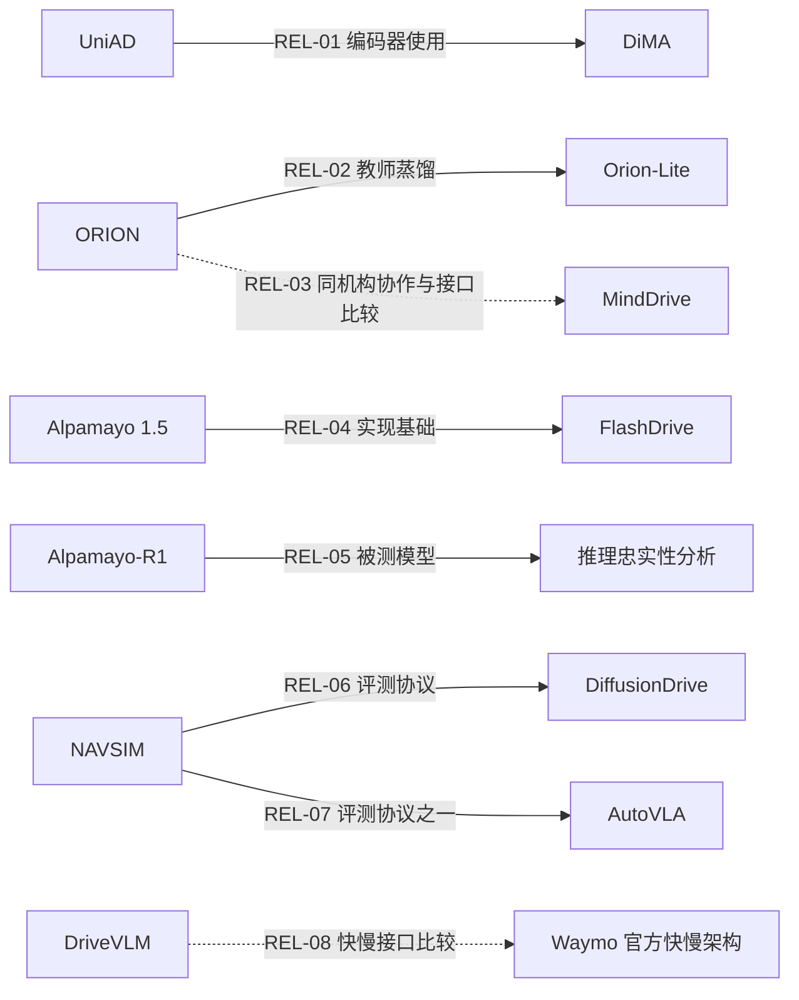
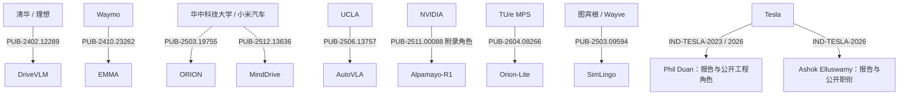

# 技术关系与组织关系图

实线表示明确使用、蒸馏或评测关系；虚线仅表示本综述的方法比较。不是影响力排名或人员师承图。每条技术边的主张、类型和定位见 [relations.json](relations.json)；原始引用边独立保留在 [citation-graph.json](citation-graph.json)。

下图的连线表示发表时机构、明确公开角色或企业披露归属，不推断所有作者的个人贡献。人员对应关系、当前任职及日期见 [organization-people.json](organization-people.json)，发表时原文对应见 [publication-identities.json](publication-identities.json)。

Tesla 的 2023 foundation-model 报告、2026 driving-policy 报告与 FSD v14.3 更新属于按日期串联的公开披露。这里不绘制未被公开资料支持的具体模型继承边。Alpamayo-R1 与当前 Alpamayo 1/1.5 发布命名见补充来源 CODE-ALPAMAYO，也不能直接视作同一评测权重。
